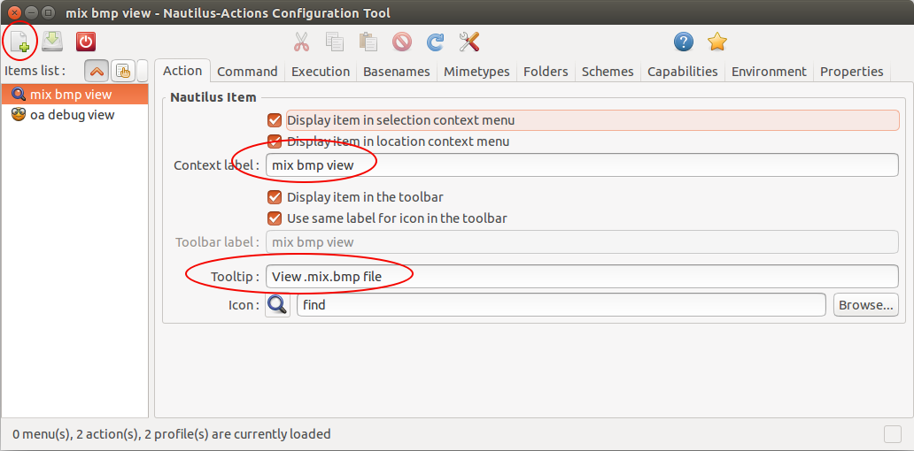
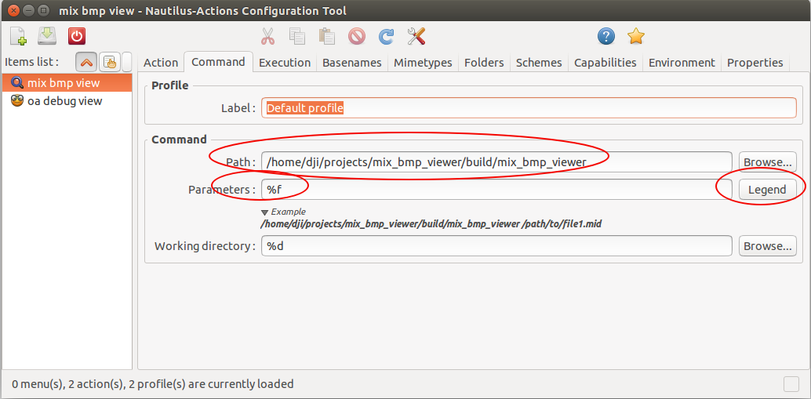
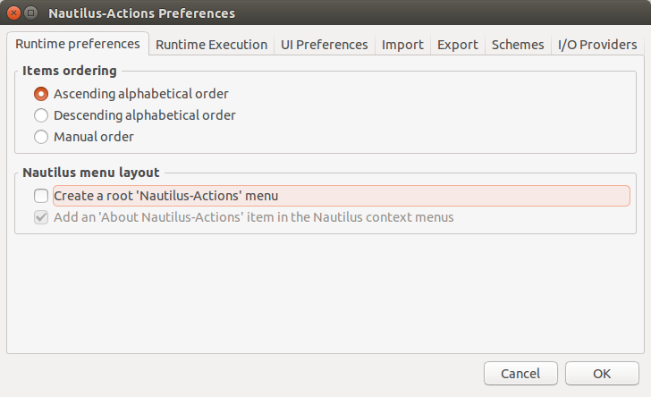

## 如何将mix_bmp_viewer程序设置成右键打开？

### Ubuntu (14.04 LTS)

1. 安装nautilus-action-manager.
```shell
sudo apt-get install nautilus-actions
```

2. 打开nautilus之后设置添加action并设置名称



3. 设置可执行文件路径，以及输入参数的形式



如果不清楚参数的形式，可以查看legend，有很详细的例子。

４．（可选）设置action成一级菜单而不是默认的二级菜单

默认添加的action都是二级菜单，每次打开起来很麻烦，通过以下方式解决。




### Windows


#### 方法一 修改注册脚本并注册
1. 编辑“注册_mix_bmp_viewer.reg"脚本，将最后一行可执行文件路径改成你电脑上mix_bmp_viewer.exe文件的路基，例如”F:\\projects\\mix_bmp\\mix_bmp_viewer\\build-windows\\release\\mix_bmp_viewer.exe“，其他不变。
2. 关闭脚本，然后双击注册即可。

#### 方法二 手动添加到注册表
1. Windows键+R打开run，输入regedit打开注册表。
2. 在如图所示目录下新建项：mix bmp viewer，并且新建子项：Command，这个名字就是Command，不要变，表示可执行文件的路径，最后注意空格后的参数"%1"不要漏，否则程序得不到输入参数。


